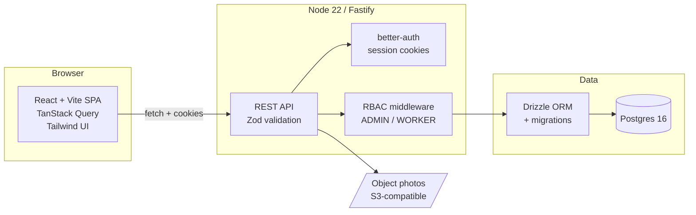
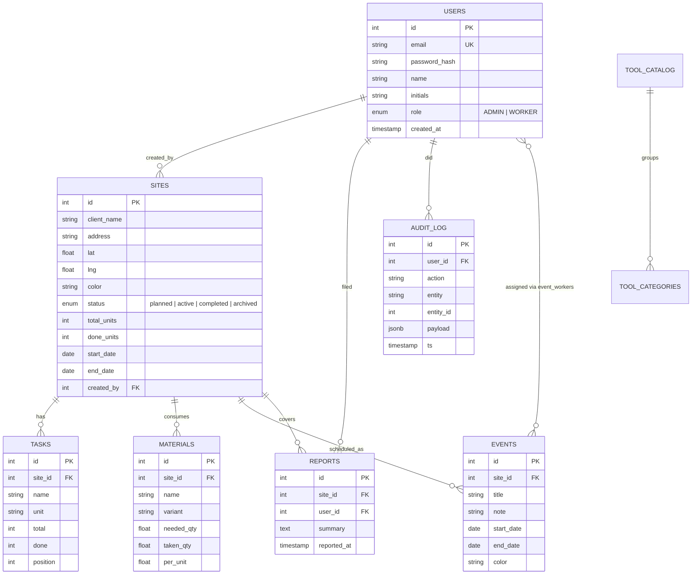
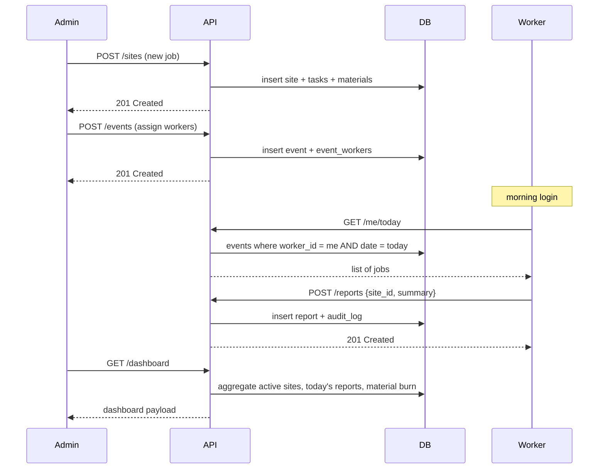

# GlossPilot

> Field-ops dashboard for mobile car-detailing crews — dispatch jobs, track materials, log daily work.

**Status:** v0.1.0 — bootstrap phase. No backend yet, no DB yet.
**License:** MIT
**Stack:** Node 22 · Fastify · TypeScript · Postgres 16 · Drizzle ORM · React 18 · Vite · Tailwind · better-auth

---

## Why this exists

A real, runnable starter kit for the pattern "field-services dispatch + worker app":
**admin** plans the schedule, assigns workers, tracks material stock; **workers** see their day, mark progress, log usage. Same shape powers cleaning crews, HVAC service, property maintenance, and yes — car detailing.

Open-source so others can fork it for their own niche instead of vibe-coding the same wheel a hundredth time.

---

## Architecture



## Domain model



## User flow (admin vs. worker)



---

## Quickstart

```bash
# requires: node 22, pnpm, postgres 16, docker (optional)
git clone <repo>
cd glosspilot
cp .env.example .env          # fill in DATABASE_URL + AUTH_SECRET
pnpm install
pnpm db:migrate
pnpm db:seed                  # demo: 6 users, 5 sites, 8 events
pnpm dev                      # api + web in parallel
```

Demo logins after seed:
- Admin: `dispatch@glosspilot.dev` / `demo`
- Worker: `crew1@glosspilot.dev` / `demo`

---

## Project layout

```
glosspilot/
├── apps/
│   ├── api/                  # Fastify + Drizzle
│   └── web/                  # React + Vite
├── packages/
│   └── shared/               # zod schemas, types
├── docs/
│   ├── adr/                  # architecture decisions
│   ├── architecture.html     # local mermaid preview
│   └── HOW-IT-WORKS.md       # user guide (TODO)
├── docker-compose.yml        # postgres + adminer
├── .env.example
└── CHANGELOG.md
```

---

## Non-goals (intentionally NOT in scope)

- Multi-tenancy (one company per deployment — fork for SaaS)
- Real-time push (polling is fine for ≤50 users)
- Mobile-native app (responsive web works for the field)
- Invoicing / payments (out of scope, integrate Stripe externally)
- AI features (this is a clean reference impl — add agents in your fork)

---

## Roadmap

- [x] v0.1.0 — bootstrap, docs, ADRs
- [ ] v0.2.0 — auth + RBAC + users CRUD
- [ ] v0.3.0 — sites + tasks + materials CRUD
- [ ] v0.4.0 — calendar + event assignment
- [ ] v0.5.0 — reports + dashboard
- [ ] v0.6.0 — file uploads (object photos)
- [ ] v0.7.0 — audit log viewer
- [ ] v1.0.0 — Dockerized, deployed demo, docs complete

---

## License

MIT — see `LICENSE`.
